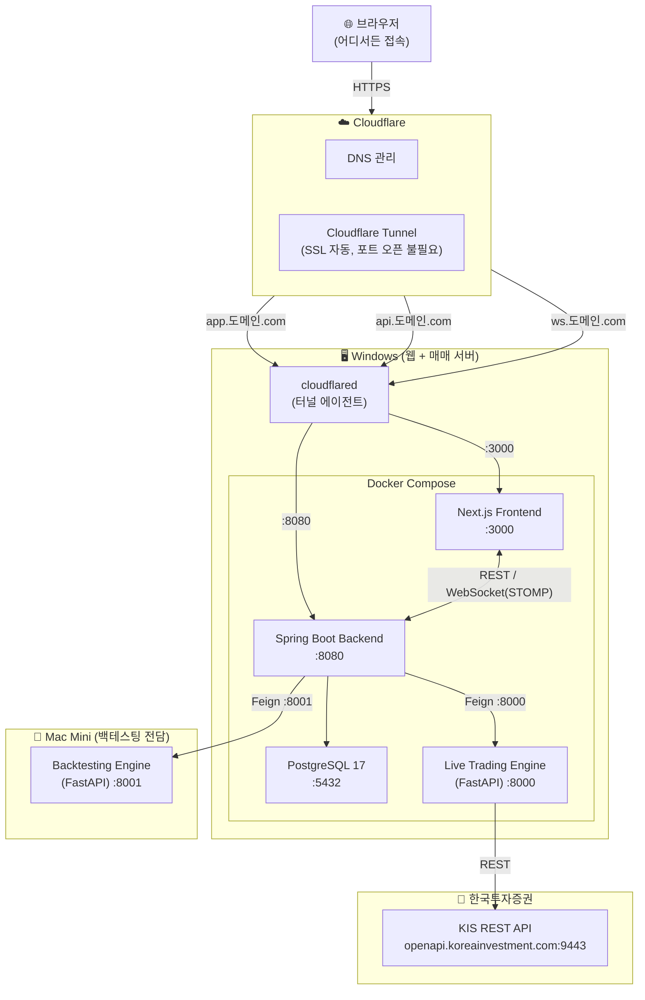
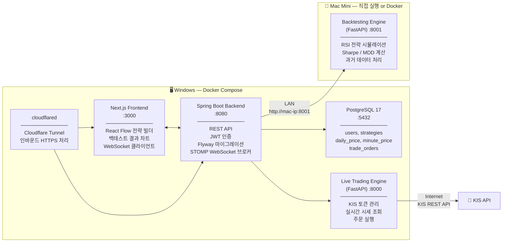
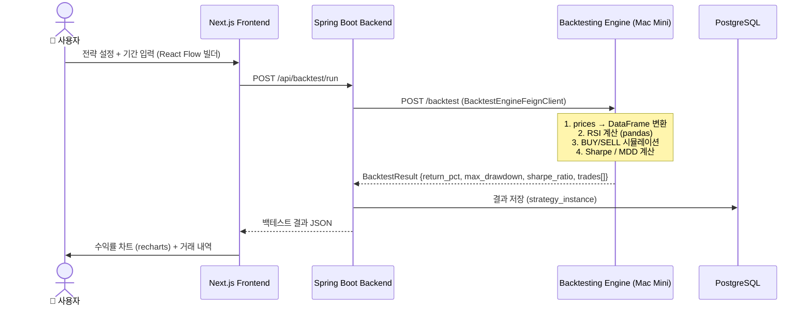
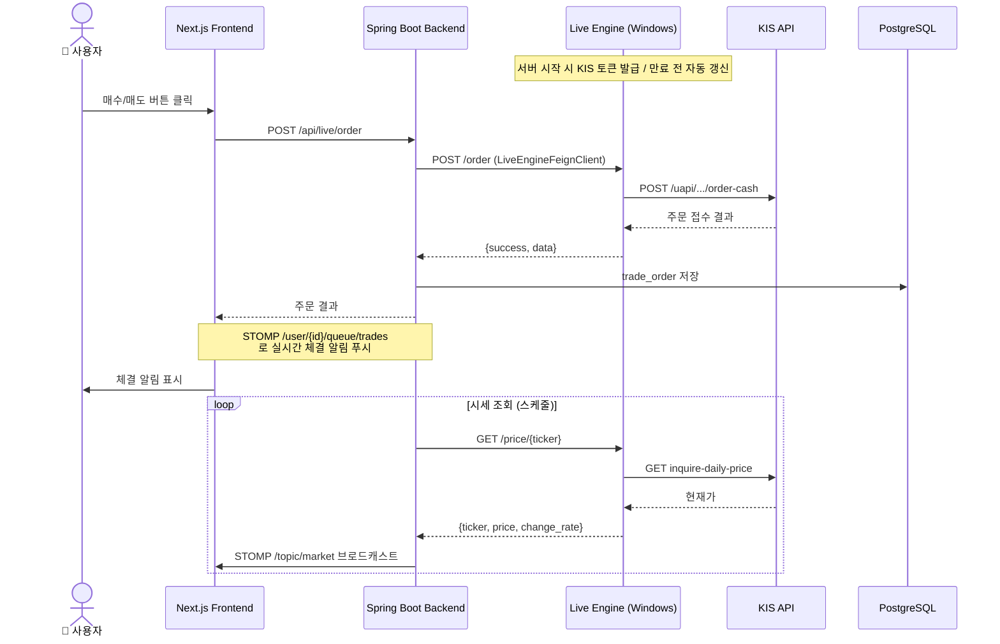
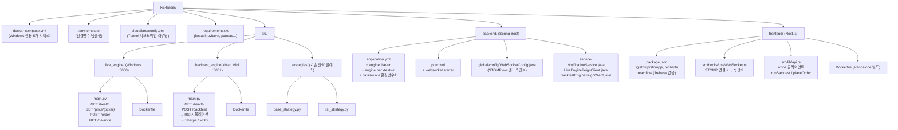
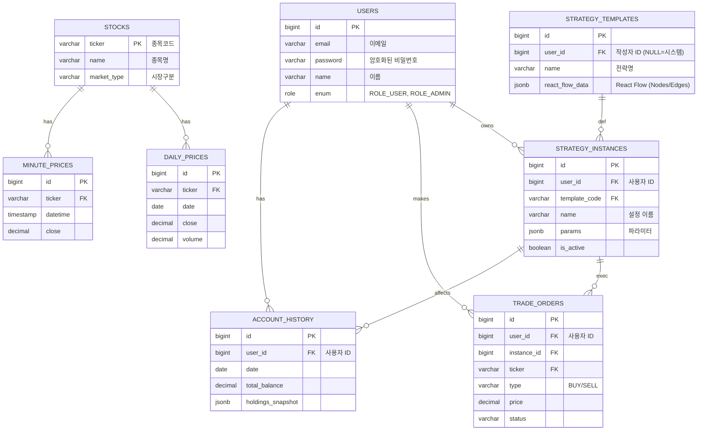

# 풀스택 주식 자동화 시스템 설계서

> **v2 — 로컬 배포 전환 (2026.03)**
> GCP 기반 설계에서 Windows + Mac Mini 2대 로컬 머신으로 전환.
> Cloudflare Tunnel로 HTTPS 외부 접근, Firebase → Spring Boot WebSocket(STOMP) 대체.

---

## 1. 전체 네트워크 아키텍처



### 클라우드 → 로컬 전환 대응표

| 기존 (GCP) | 변경 (Local) |
|---|---|
| GCP Cloud SQL (PostgreSQL 17) | Windows Docker `postgres:17` |
| Firebase RTDB (실시간 알림) | Spring Boot WebSocket + STOMP |
| GCP Compute Engine (단일 VM) | Windows(웹/매매) + Mac Mini(백테스팅) 분산 |
| Cloud NAT → KIS API | Windows 직접 인터넷 연결 |
| HTTPS + 도메인 | Cloudflare Tunnel (SSL 자동, 포트 오픈 불필요) |
| Nginx 리버스 프록시 | Cloudflare Tunnel + 서비스별 서브도메인 |

---

## 2. 머신별 서비스 구성



| 머신 | 역할 | 실행 서비스 |
|---|---|---|
| **Windows** | 웹 서버 + 실전 매매 서버 | Next.js, Spring Boot, PostgreSQL, Live Engine, cloudflared |
| **Mac Mini** | 개발 + 백테스팅 전담 | Backtesting Engine (FastAPI) |

---

## 3. 데이터 흐름

### 3-1. 백테스팅 흐름



### 3-2. 실전 매매 흐름



---

## 4. 프로젝트 파일 구조



---

## 5. Python Engine 분리 설계

| 서비스 | 위치 | 역할 | 주요 엔드포인트 |
|---|---|---|---|
| `live-engine` | Windows :8000 | KIS 토큰 관리, 실시간 시세, 주문 실행 | `POST /order`, `GET /price/{ticker}`, `GET /balance` |
| `backtest-engine` | Mac Mini :8001 | 과거 데이터 시뮬레이션, 지표 계산 | `POST /backtest`, `GET /health` |

Backend(Spring Boot)가 요청 유형에 따라 라우팅:
- 백테스팅 → `${engine.backtest-url}` (Mac Mini)
- 실전 매매 → `${engine.live-url}` (Windows localhost)

---

## 6. 데이터베이스 설계 (ERD)

전략(Definition)과 실행(Instance)을 분리하여 확장성을 확보했습니다.



### JSONB 컬럼 상세

**`strategy_templates.react_flow_data`** (UI Canvas 저장용)
```json
{
  "nodes": [
    { "id": "node-1", "type": "dataSource", "data": { "label": "Samsung Electronics" }, "position": { "x": 100, "y": 100 } },
    { "id": "node-2", "type": "indicator", "data": { "name": "RSI", "period": 14 }, "position": { "x": 300, "y": 100 } }
  ],
  "edges": [{ "id": "edge-1", "source": "node-1", "target": "node-2" }],
  "viewport": { "x": 0, "y": 0, "zoom": 1.5 }
}
```

**`strategy_instances.params`** (전략 실행 파라미터)
```json
{
  "target_tickers": ["005930", "000660"],
  "timeframe": "1D",
  "buy_threshold": 30,
  "sell_threshold": 70,
  "stop_loss_pct": 0.03
}
```

**`account_history.holdings_snapshot`** (일별 보유종목 스냅샷)
```json
[
  { "ticker": "005930", "qty": 10, "avg_price": 70500, "cur_price": 71000, "pnl_pct": 0.7 },
  { "ticker": "035420", "qty": 5, "avg_price": 210000, "cur_price": 205000, "pnl_pct": -2.3 }
]
```

---

## 7. 기술 스택

| 레이어 | 기술 |
|---|---|
| **Frontend** | Next.js 15, React 19, TypeScript, React Flow, recharts, @stomp/stompjs |
| **Backend** | Spring Boot 3.4, Java 21, Spring Security, OpenFeign, WebSocket(STOMP), Flyway |
| **Live Engine** | Python 3.12, FastAPI, uvicorn |
| **Backtest Engine** | Python 3.12, FastAPI, pandas 2.2, numpy |
| **Database** | PostgreSQL 17 (Docker) |
| **인프라** | Docker Compose (Windows), Cloudflare Tunnel, cloudflared |

---

## 8. 주요 기능

1. **사용자 인증** — JWT 기반 로그인/회원가입, ROLE_USER / ROLE_ADMIN 권한 분리
2. **전략 빌더** — React Flow 노드 기반 드래그앤드롭 전략 설계, 템플릿 선택
3. **백테스팅** — 과거 데이터 RSI 시뮬레이션 → 수익률/MDD/Sharpe 차트 (Mac Mini 처리)
4. **실전 매매** — KIS API 연동, 자동 주문 실행, STOMP WebSocket 실시간 체결 알림
5. **자산 관리** — 일별/월별 누적 수익금, 포지션 현황 대시보드

---

## 9. 실행 방법

### Windows (웹 + 매매 서버)
```bash
# 1. 환경변수 설정
cp .env.template .env
# .env 파일에서 KIS 키, DB 비밀번호, BACKTEST_ENGINE_URL(Mac Mini IP) 입력

# 2. 전체 서비스 기동
docker compose up -d

# 3. 헬스체크
curl http://localhost:8080/actuator/health
curl http://localhost:8000/health
```

### Mac Mini (백테스팅 서버)
```bash
pip install -r requirements.txt
uvicorn src.backtest_engine.main:app --host 0.0.0.0 --port 8001
```

### Cloudflare Tunnel 설정
```bash
# 1. Tunnel 생성
cloudflared tunnel create kis-trader

# 2. cloudflare/config.yml 에서 <tunnel-id> 교체

# 3. DNS 레코드 추가 (Cloudflare Dashboard)
#    app.도메인.com → tunnel
#    api.도메인.com → tunnel
#    ws.도메인.com  → tunnel
```

---

## 10. MVP 개발 순서

1. Windows `docker compose up -d` — postgres + backend 기동
2. Mac Mini backtest-engine 기동
3. Backend → Backtest Engine 통신 확인 (`GET /health`)
4. React Flow 전략 빌더 → `/backtest` API 연동
5. 백테스트 결과 차트 UI
6. WebSocket 실시간 알림
7. Live Trading Engine 기동 + KIS 가상계좌 연동 (최후)
