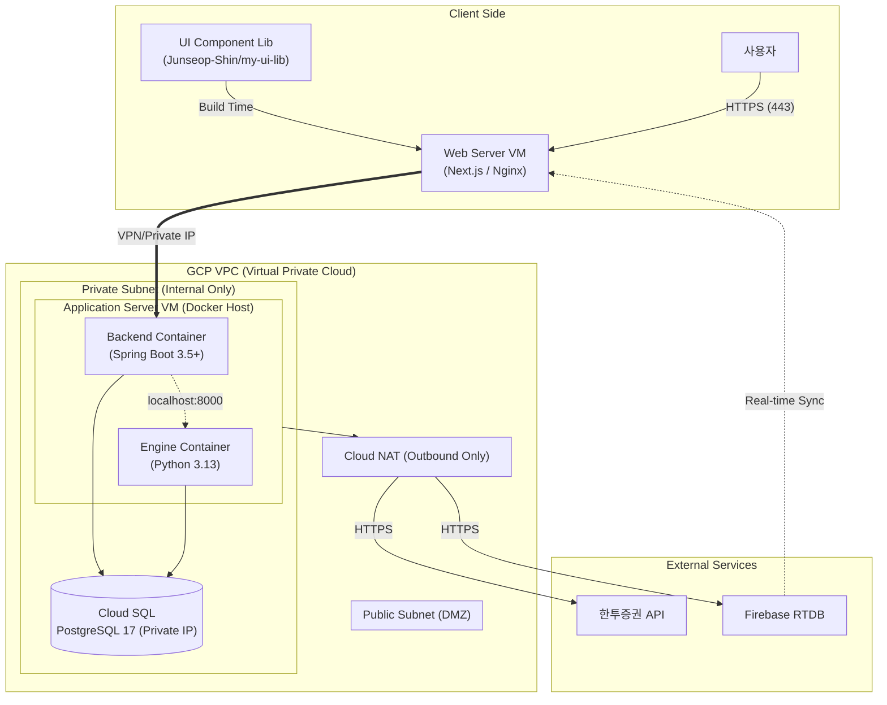
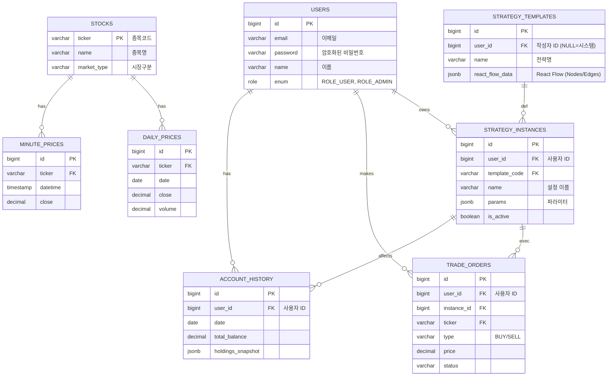

# 풀스택 주식 자동화 시스템 설계서 (Full-Stack Stock Automation System Design)

## 1. 시스템 아키텍처 (System Architecture) - 보안 강화 및 VM 분리 모델

외부망(Public)과 내부망(Private)을 철저히 분리하여 보안성을 극대화한 **VPC 기반 아키텍처**입니다.



### 보안 및 네트워크 설계 핵심
1.  **Web Server (Public)**: 유일하게 외부 접속이 가능한 진입점입니다. 사용자 인증 후 내부 API를 호출합니다.
2.  **App Server VM (Private)**: 백엔드와 엔진이 하나의 고사양 VM에서 컨테이너로 실행됩니다. 외부와는 단절되어 있으며, 오직 Web Server만 접근 가능합니다.
3.  **Cloud SQL**: Private Service Connect로 내부망에서만 접근합니다.

## 2. 데이터베이스 설계 (ERD) - 전략 유연성 강화
전략(Definition)과 실행(Instance)을 분리하여 확장성을 확보했습니다.



### 2.1 NoSQL Data Structure (JSON & Firebase)
비정형 데이터(JSON Key-Value)에 대한 명세입니다.

#### A. PostgreSQL JSONB Columns
1.  **`strategy_templates.react_flow_data`** (UI Canvas 저장용)
```json
{
  "nodes": [
    { "id": "node-1", "type": "dataSource", "data": { "label": "Samsung Electronics" }, "position": { "x": 100, "y": 100 } },
    { "id": "node-2", "type": "indicator", "data": { "name": "SMA", "period": 20 }, "position": { "x": 300, "y": 100 } }
  ],
  "edges": [
    { "id": "edge-1", "source": "node-1", "target": "node-2" }
  ],
  "viewport": { "x": 0, "y": 0, "zoom": 1.5 }
}
```

2.  **`strategy_instances.params`** (전략 실행 파라미터)
```json
{
  "target_tickers": ["005930", "000660"],
  "timeframe": "1D",   // 1D, 15M, 5M
  "buy_threshold": 30, // RSI < 30
  "sell_threshold": 70, // RSI > 70
  "stop_loss_pct": 0.03 // -3% Stop Loss
}
```

3.  **`account_history.holdings_snapshot`** (일별 보유종목 스냅샷)
```json
[
  { "ticker": "005930", "qty": 10, "avg_price": 70500, "cur_price": 71000, "pnl_pct": 0.7 },
  { "ticker": "035420", "qty": 5, "avg_price": 210000, "cur_price": 205000, "pnl_pct": -2.3 }
]
```

#### B. Firebase Realtime DB (RTDB) Structure
실시간 알림 및 상태 공유를 위한 키-값 구조입니다.

| Path | Key | Value (Example) | Description |
| :--- | :--- | :--- | :--- |
| **/notifications** | `{userId}/{notiId}` | `{ "type": "TRADE", "msg": "삼성전자 매수 체결", "read": false }` | 사용자별 웹 푸시 알림 |
| **/strategies** | `{instanceId}/status` | `{ "isRunning": true, "currentPnl": 12.5, "lastUpdate": "14:30:00" }` | 전략 실행 상태 모니터링 |
| **/trades** | `{instanceId}/latest` | `{ "symbol": "005930", "side": "BUY", "price": 70000 }` | 차트 위 매매 마크 표시용 |

## 3. 기술 스택 (Updated 2025.12 Standard)
*   **Web**: Next.js 15 (React 19), TypeScript 5.5+
*   **Backend**: Spring Boot 3.5 (Java 25 LTS Compatible)
    *   **Communication**: Spring Cloud 2024.0 (OpenFeign)
*   **Engine**: Python 3.13, FastAPI (Async), Pandas 2.2+
*   **Infra**: GCP Compute Engine (VM), Cloud SQL (PG 17), Firebase

## 4. 주요 기능 (Key Features) - Frontend Focus
사용자(Trader)가 웹 대시보드에서 수행하는 핵심 활동입니다.

1.  **사용자 인증 (Authentication)**:
    *   **로그인/회원가입**: JWT 기반의 안전한 로그인 시스템.
    *   **권한 관리**: 일반 사용자(User)와 관리자(Admin) 권한 분리.
2.  **전략 빌더 (Strategy Builder)**:
    *   **Drag & Drop**: React Flow를 이용해 노드 기반으로 자신만의 매매 전략을 시각적으로 설계합니다.
    *   **템플릿 선택**: 미리 정의된 전략(`MA_CROSS`, `RSI_BOUND`)을 선택하고 파라미터를 튜닝합니다.
3.  **백테스팅 (Backtesting)**:
    *   설계한 전략을 과거 데이터에 적용해보고 수익률(ROI), 승률, 손익비(MDD)를 차트로 확인합니다.
4.  **실전 매매 (Live Trading)**:
    *   검증된 전략을 "활성화(Active)" 상태로 전환하여 자동 매매를 시작합니다.
    *   **모니터링**: 실시간으로 체결 내역과 현재 포지션 수익률이 Firebase를 통해 푸시됩니다.
5.  **자산 관리 (Asset Management)**:
    *   일별/월별 누적 수익금과 자산 추이 그래프를 제공합니다.

## 5. 데이터 흐름 (Data Flow)
1.  **전략 설정**: 사용자가 Frontend에서 React Flow로 전략을 구상하거나(Advanced), 템플릿을 선택해 파라미터를 입력합니다.
2.  **백테스트 요청**: `Web` -> `Backend` -> `Engine` (비동기). 결과는 DB 저장 후 반환.
3.  **실전 매매**: `Backend`의 스케줄러가 `Strategy Instance`를 로드 -> `KIS API` 시세 조회 -> 조건 부합 시 `Engine` 검증 -> `Order` 실행.
4.  **실시간 피드백**: 주문 체결 시 `Backend` -> `Firebase RTDB` -> `Web` (즉시 알림).
